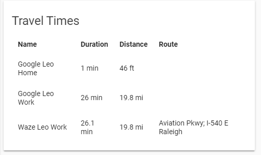

# Github Card for Home Assistant



[![GitHub Release][releases-shield]][releases]
[![License][license-shield]](LICENSE.md)

![Project Maintenance][maintenance-shield]
[![GitHub Activity][commits-shield]][commits]

## Track Updates

This custom card can be tracked with the help of [custom-updater](https://github.com/custom-components/custom_updater).

In your configuration.yaml

```yaml
custom_updater:
  card_urls:
    - https://raw.githubusercontent.com/ljmerza/github-card/master/custom_updater.json
```

## Options

| Name | Type | Requirement | `Default` Description
| :---- | :---- | :------- | :----------- |
| title | string | **Optional** | `Github` Change card title
| entities | list | **Required** | List of github sensors to display
| show_extended | boolean | **Optional** | `true` Show/hide tags, forks, and commits links

## Configuration

Download `github-card.js` from the [latest release](https://github.com/ljmerza/github-card/releases/latest/) and upload it your /www folder of your Home Assistant config directory.

In your ui-lovelace.yaml

```yaml
resources:
  - url: /local/github-card.js?v=1.2.0
    type: js
```

Add the custom card to views:

```yaml
views:
  - type: custom:github-card
    entities:
    - sensor.calendar_card
    - sensor.waze_card
    - sensor.light_entity_card
```

Enjoy my card? Help me out for a couple of :beers: or a :coffee:!

[](https://www.buymeacoffee.com/JMISm06AD)


[commits-shield]: https://img.shields.io/github/commit-activity/y/ljmerza/github-card.svg?style=for-the-badge
[commits]: https://github.com/ljmerza/github-card/commits/master
[license-shield]: https://img.shields.io/github/license/ljmerza/github-card.svg?style=for-the-badge
[maintenance-shield]: https://img.shields.io/badge/maintainer-Leonardo%20Merza%20%40ljmerza-blue.svg?style=for-the-badge
[releases-shield]: https://img.shields.io/github/release/ljmerza/github-card.svg?style=for-the-badge
[releases]: https://github.com/ljmerza/github-card/releases